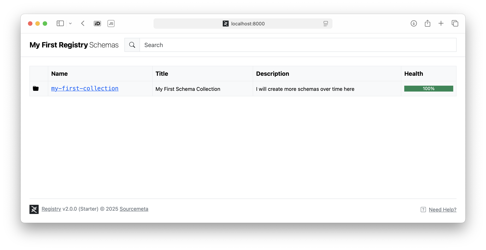

---
hide:
  - navigation
---

# Getting Started

The Sourcemeta Registry operates on a two-phase architecture: **indexing** and
**serving**. During the *indexing* phase, the Registry scans, analyses, and
compiles your schemas. This preprocessing phase creates a highly optimised
cache that enables blazing-fast schema retrieval and evaluation during the
*serving* phase.

As you will see in this guide, setting up the Sourcemeta Registry is
straightforward:

1. Create a [configuration file](configuration.md) that sets up your registry
   exactly as you want it
2. Create a `Dockerfile` that extends the slim [official base
   images](https://github.com/orgs/sourcemeta/packages?repo_name=registry) and
   indexes your schemas at build time
3. Run the optimised registry

## Hello World

Got two minutes to spare and [Docker](https://www.docker.com) installed on your
machine? Brilliant! Let's get a sample instance of the Registry up and running
locally in no time.

### Our First Schema

Every good story starts with a character, so let's create a simple person
schema. Pop this into a file called `schemas/person.json`:

```json title="schemas/person.json"
{
  "$schema": "https://json-schema.org/draft/2020-12/schema",
  "title": "Person",
  "description": "A simple schema for describing a person",
  "type": "object",
  "required": [ "name", "age" ],
  "properties": {
    "age": { "type": "integer", "minimum": 0 },
    "name": { "type": "string" }
  },
  "additionalProperties": false
}
```

!!! tip

    We know that working with schemas can be a bit of a maze—authoring,
    maintaining, debugging, and testing them all have their quirks. For a
    smoother ride, we highly recommend the open source [Sourcemeta JSON Schema
    CLI](https://github.com/sourcemeta/jsonschema) as your trusty sidekick, and
    do bookmark our [Learn JSON
    Schema](https://www.learnjsonschema.com/2020-12/) site for those moments
    when you need a quick reference on JSON Schema specifics.

### Configuring the Registry

Now for the magic ingredient: a [configuration file](configuration.md) that
tells the Registry which schemas to feast upon. Whilst the full configuration
documentation covers loads more options, we'll keep things simple here. We're
setting our `url` to `http://localhost:8000` (where we'll serve our schemas),
adding a touch of personality with a custom name in the `html` section, and
creating our very first schema collection called `my-first-collection`. This
collection will gobble up our person schema by pointing to the `schemas`
directory we just created. Save this as `registry.json` alongside your
`schemas` folder:

```json title="registry.json"
{
  "url": "http://localhost:8000",
  "html": {
    "name": "My First Registry"
  },
  "contents": {
    "my-first-collection": {
      "title": "My First Schema Collection",
      "description": "I will create more schemas over time here",
      "path": "./schemas"
    }
  }
}
```

### Writing a `Dockerfile`

Time to put it all together! Create a `Dockerfile` with these contents. We're
extending the official `sourcemeta/registry` image from [GitHub
Packages](https://github.com/orgs/sourcemeta/packages?repo_name=registry),
copying our configuration file and schemas directory into the container, and
then running the indexing process with the `sourcemeta` command. Simple as
that!

```docker title="Dockerfile"
FROM ghcr.io/sourcemeta/registry:3.2
COPY registry.json .
COPY schemas schemas
RUN sourcemeta registry.json
```

### Running Locally

Right, we're all set! Let's build our Docker image (we'll call it
`my-first-registry`) and fire up the Registry. The Registry serves on port 8000
by default, so we'll expose that:

```sh
$ docker build --tag my-first-registry . --file Dockerfile
$ docker run --publish 8000:8000 my-first-registry
```

Now head over to [http://localhost:8000](http://localhost:8000) in your
favourite web browser, and you'll be greeted by your very own instance:



### Next Steps

Congratulations! You've just built your first Sourcemeta Registry in under two
minutes (told you so!). Whilst our single-schema registry might seem modest,
you've got the perfect foundation to experiment and expand.

Ready to take things further? Take a look at our
[integrations](integrations.md) which cover ways on which you can pull and use
the schemas in a growing amount of programming languages and applications.

We also recommend exploring the full range of options in the Registry
[configuration file](configuration.md), discovering how to import ready-made
schema collections through our [built-in schema library](library.md), exploring
the [HTTP API](api.md), and having a peek at
[schemas.sourcemeta.com](https://schemas.sourcemeta.com) to see what a
fully-fledged public instance looks like in the wild.

## Using Docker

The Sourcemeta Registry is exclusively distributed as Docker images published
to [GitHub
Packages](https://github.com/orgs/sourcemeta/packages?repo_name=registry). We
provide multi-architecture images supporting both x64 and arm64 platforms,
ensuring compatibility across different systems whilst maintaining consistent
behaviour. Docker is the only officially supported method for running the
Registry and we do not provide platform-specific binaries for individual
operating systems.

To run the Registry, create a `Dockerfile` that extends our base image and
follows the build pattern shown below:

```docker title="Dockerfile"
# See https://github.com/orgs/sourcemeta/packages?repo_name=registry
FROM ghcr.io/sourcemeta/registry:<version>

# (2) Copy your configuration file and schemas to the *working directory*
# Avoid copying files to other paths outside the working directory, as
# the indexer will not automatically clean them up for you if so!
# See https://registry.sourcemeta.com/configuration/
COPY registry.json .
COPY schemas schemas

# (3) Run the Registry build step on your input configuration file
# The indexer will automatically remove the input schemas from the
# working directory to keep the image lean
RUN sourcemeta registry.json
```

The build process follows a straightforward pattern: extend the base image,
copy your configuration and schema files into the working directory, and run
the indexing command. The indexer automatically removes source schemas after
processing to keep the final image size minimal.

### Environment Variables

The Registry can be configured using the following runtime environment variables.

| Name | Default | Description |
|------|---------|-------------|
| `SOURCEMETA_REGISTRY_PORT` | `8000` | The HTTP port on which the Registry will listen on |

## Using Docker Compose

For more complex deployments or when integrating the Registry alongside other
services, [Docker Compose](https://docs.docker.com/compose/) provides a
convenient orchestration method. The following example demonstrates a basic
setup that builds your Registry image and exposes it on the desired port:

```yaml title="compose.yaml"
services:
  registry:
    build:
      # The Dockerfile that extends the Registry base image
      dockerfile: Dockerfile
      context: .
    environment:
      # Set your desired port
      - SOURCEMETA_REGISTRY_PORT=8000
    ports:
      # Expose the ports accordingly
      - "8000:8000"
```

This configuration builds your custom Registry image using the `Dockerfile` in
the current directory and maps the container's port to your host system. You
can extend this setup to include additional services, networks, or volumes as
needed for your specific deployment requirements.
